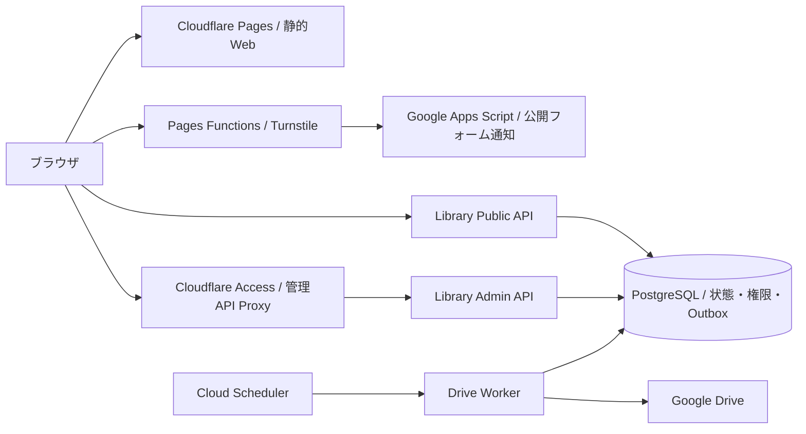

# COMPASS Platform

**Don’t Just Learn. Build What’s Next.**
**学びを、意思決定の力へ。**

COMPASS Platformは、主に北里大学の学生に向けて、学習・進路・コミュニティを横断したデジタル体験を提供する教育・テクノロジープラットフォームです。

本リポジトリは、3Dレンダリングを取り入れた公式Webサイトと、利用者データ基盤、認証、API、データベース、クラウド、CI/E2Eなど、その運用を支えるシステムを管理しています。


[公開Web](https://compass-official.pages.dev/) · [技術スタック](#技術スタック) · [開発を始める](#開発を始める) · [文書索引](docs/README.md) · [利用許可](#ライセンスと利用許可)

## プロダクトと実装範囲

| 対象 | システム構成 |
|---|---|
| 公式Web | Next.js / React / TypeScript、Three.js / WebGLによる3D Habitat、Blenderアセット、レスポンシブ・メディア制御 |
| Contact / Community申請基盤 | Cloudflare Pages Functions、Turnstile、入力検証、Google Apps Scriptによる通知処理 |
| 未来戦略ライブラリ登録基盤 | FastAPI、Neon PostgreSQL、Google Identity / OIDC、Cloud Run / Scheduler、SQLAlchemy / Alembic、Google Drive API、Cloudflare Access、Secret Manager、Terraform、DB RBAC、Transactional Outbox、監査ログ |
| Interactive紹介 | COMPASS Interactiveのプロダクト紹介・技術情報を提供するWebサイト |

COMPASS Interactiveのアプリケーション本体は、別リポジトリ・別環境で開発しています。配置と編集範囲は[Website Boundaries](docs/WEBSITE_BOUNDARIES.md)に記載しています。

## 体験を支える技術

### ブラウザで描く3D空間

公式トップのHabitatは、Three.jsによるWebGL描画とHTML UIで構成されています。9つのセクションに対応する空間とカメラを持ち、単一のレンダラーで描画しています。文章、リンク、フォームは通常のDOMとして実装されています。

建築と家具はBlenderで制作し、間接光はライトマップにベイクしています。ランタイムではPBR材質、HDR環境光、反射、Bloomを使用し、glTF/GLBはMeshopt、画像はWebPで圧縮しています。

3Dの有効化は画面幅と入力方式を基準に制御しています。低フレームレート、読み込み失敗、Reduced Motionでは静止画へフォールバックします。非表示タブでは描画を停止し、アンマウント時にはGPUリソースを解放しています。環境音にはWeb Audio APIを使用しています。

実装は[Habitat](src/components/Habitat/)、制作手順は[Authoring Guide](scripts/habitat/README.md)、素材の出典は[Asset Credits](scripts/habitat/ASSET_CREDITS.md)に記載しています。通常のWebビルドにBlenderは必要ありません。

### モバイルと映像表現

縦向きのタブレットやスマートフォンでは、NASAのISS写真と短いタイムラプスを使用しています。動画は表示領域や通信状態に応じて読み込みと再生を制御し、データ節約設定、低速回線、再生失敗時には静止画へ切り替わります。モバイルでは3DエンジンやGLBを読み込まないこともテストで確認しています。

Contactの導入には、Blenderで制作した建築映像を使用しています。映像上の扉にはHTMLボタンを重ね、選択に応じて映像を切り替えます。演出はスキップ可能で、Reduced Motionや読み込み失敗時にもフォームへ遷移できます。

制作条件と挙動の詳細は[Mobile Space Media](docs/mobile-space-media.md)と[Contact Door Entry](docs/contact-door-entry.md)に記載しています。

### 利用者データ基盤および未来戦略ライブラリ登録基盤

未来戦略ライブラリの登録基盤は、FastAPI、Neon PostgreSQL、Google Cloud Runを中心に構成しています。Public API、Admin API、Drive Worker、Migration Jobを分離し、それぞれに必要な権限だけを持たせています。Google IDトークンはバックエンドで検証し、利用資格や管理者権限もサーバー側で判定します。

PostgreSQLではPublic API、Admin API、Worker、MigrationごとにDBロールを分け、各サービスから実行できる操作を限定しています。SQLAlchemy / Psycopgで接続し、スキーマ変更はAlembicで管理しています。登録や管理操作のうち、権限境界を越える処理はRPCに寄せ、アプリケーションから直接触れる範囲を絞っています。

Google Driveへの権限反映は同期処理にせず、Transactional Outboxを介してWorkerへ渡しています。WorkerはCloud SchedulerからOIDC付きで起動し、Lease、Retry、操作署名を確認したうえでDrive APIを実行します。これにより、DB更新と外部API呼び出しを分離しつつ、重複実行や途中失敗を扱える構成にしています。

管理APIはCloudflare側のプロキシと共有シークレットを経由し、Google認証とDB側の権限判定を重ねています。Secret ManagerではDB接続情報やDrive OAuth情報を用途ごとに分離し、Cloud Runの各サービスには必要なSecretだけを渡します。

インフラはTerraformで定義し、Cloud Run、Cloud Run Jobs、Cloud Scheduler、IAM、Secret Managerまでコード化しています。Migration、Public API、Admin API、Drive処理は個別に有効化できるようにし、本番反映時には段階的に公開範囲を広げられる構成です。管理操作、権限変更、エクスポート処理は監査ログに記録しています。



上図の構成や各サービスの役割は[Architecture](docs/ARCHITECTURE.md)、管理APIの認可設計は[Admin Access Security Boundary](docs/library-registration/admin-access-security-boundary.md)を参照してください。


## 技術スタック

バージョンはこのリポジトリの依存定義に対応します。配信済みのバージョンはデプロイ先のコミットで確認します。

| 領域 | 技術と用途 |
|---|---|
| Web | Next.js 16.3.4 · React 19 · TypeScript 5.9 · Zod 4 · Static Export |
| 3D | Three.js 0.185 · WebGL · glTF/GLB · Meshopt · PBR · HDR · 焼き込みライトマップ |
| 素材制作 | Blender 4.5 LTS · Open Image Denoise · glTF Transform 4.5 · FFmpeg · WebP/H.264 |
| 音・操作 | Web Audio API · Native DOM · Pointer / Keyboard · Reduced Motion |
| Edge配信 | Cloudflare Pages · Pages Functions · Turnstile · Cloudflare Access |
| API・認証 | Python 3.12–3.13 · FastAPI · Pydantic 2 · Uvicorn · Google Identity Services / OpenID Connect |
| データ | PostgreSQL 17 · Neon · SQLAlchemy 2 · Psycopg 3 · Alembic |
| 権限処理 | Google Drive API · Transactional Outbox · Lease / Retry · Operation Attestation |
| 実行環境・IaC | Google Cloud Run / Jobs · Cloud Scheduler · Secret Manager · Terraform · Docker Compose |
| 通知・計測 | Google Apps Script · Google Analytics 4 · Cloudflare Web Analytics |
| 検証 | Vitest · Pytest · Playwright · Node.js Test Runner · CodeQL · npm Audit · OSV |
| 開発環境 | GitHub Codespaces · Dev Containers · Codex Cloud · npm / uv lockfiles |

正確な解決バージョンは[package-lock.json](package-lock.json)と[uv.lock](services/library-api/uv.lock)、ツールの固定値は[toolchain.env](.devcontainer/toolchain.env)にあります。

## テストとCI

| 対象       | 主なテスト・チェック                                               |
| -------- | -------------------------------------------------------- |
| フォーム・API | 入力検証、資格判定、認証・認可、署名検証、重複処理、通知失敗時の挙動                       |
| ビルド・配信   | Next.js静的出力、公開ルート、Pages Functionsの適用範囲、Library関連ページのビルド  |
| レスポンシブ   | viewport、改行、overflow、ナビゲーション、キーボード操作、Visual Regression   |
| 3D・メディア  | 3D起動条件、遅延読み込み、描画停止・復帰、フォールバック、モバイルでの不要アセット取得             |
| セキュリティ   | 秘密情報・保護資料の混入、Git履歴、依存関係の脆弱性、固定されていないAction / Container参照 |
| 依存関係     | npm / uv audit、ライセンス、lockfile、ツールチェーン定義の整合性              |

テストはVitest、Pytest、Playwright、Node.js Test Runnerを使用しています。CIでは型検査、ビルド、静的出力、ブラウザテスト、依存関係監査、公開リポジトリ向けのセキュリティチェックまで実行します。

3Dの描画性能や実際の外部サービス接続など、CIだけでは確認できない項目は開発者の目視によるレスポンシブテストを必須としています。


## 開発を始める

通常の開発にはGitHub CodespacesまたはCodex Cloudを使用します。共通のlockfileと検証コマンドを用い、プロジェクトごとの環境を保持します。開発・mock buildに本番の認証情報は必要ありません。

### GitHub Codespaces

1. [Open in GitHub Codespaces](https://codespaces.new/genellect/compass?quickstart=1)を開き、セットアップ完了を待ちます。
2. 次のコマンドで環境を確認し、開発サーバーを起動します。

```bash
npm run dev:doctor
npm run dev:cloud
```

Codespacesの転送ポートから画面を確認できます。Codex Cloudでは[setup script](.codex/setup.sh)が依存を準備します。環境別の起動・復旧手順は[Cloud Development](docs/CLOUD_DEVELOPMENT.md)にあります。

### 変更後の確認

```bash
npm run check:repository
npm run check
```

`check:repository`は文書リンク、ツール定義、ライセンス、保守スクリプトを確認します。`check`はフォーム関連テスト、型検査、ビルド、静的出力、レスポンシブ・Habitatのブラウザ検証を実行します。`cloud:check`は`check`の別名です。Windows PowerShellから直接実行するときは`npm.cmd run`を使用してください。

API・専用ローカルDB・E2Eの手順は[Development Workflows](docs/development-workflows.md)、依存更新と監査は[Dependency Maintenance](docs/dependency-maintenance.md)を参照してください。画像差分の基準画像はWindowsで管理しています。

## リポジトリ構成

| パス                                                                                          | 内容                                               |
| ------------------------------------------------------------------------------------------- | ------------------------------------------------ |
| [`src/app/`](src/app/)                                                                      | 公式Web、Interactive紹介、Library関連ルート                 |
| [`src/components/Habitat/`](src/components/Habitat/)                                        | 3D描画、セクション制御、メディア・音声処理                           |
| [`scripts/habitat/`](scripts/habitat/) / [`scripts/contact-entry/`](scripts/contact-entry/) | 3D・映像アセットの生成、変換、検証                               |
| [`src/library-registration/`](src/library-registration/)                                    | Library登録・管理UI、APIクライアント                         |
| [`functions/`](functions/)                                                                  | Contact / Community、管理API Proxy、ドメインルーティング       |
| [`services/library-api/`](services/library-api/)                                            | FastAPI、Drive Worker、Migration、Pythonテスト         |
| [`infra/library-registration/`](infra/library-registration/)                                | Terraform、Cloud Run、IAM、Secret Manager、Scheduler |
| [`google-apps-script/`](google-apps-script/)                                                | Contact / Communityの通知処理                         |
| [`tests/`](tests/)                                                                          | フロントエンド、レスポンシブ、3D、配信まわりのテスト                      |
| [`.github/workflows/`](.github/workflows/)                                                  | CI、セキュリティチェック、依存関係監査                             |

公式トップは `src/app/(official)/page.tsx` → `src/App.tsx` → `src/LegacyPageBody.tsx` の順に描画されます。`LegacyPageBody.tsx` は名称に反して現行実装です。

## ドキュメント

| 文書 | 目的 |
|---|---|
| [Documentation Index](docs/README.md) | 正本文書、運用手順、過去の記録への入口 |
| [Project Guide](Project.guide/PROJECT_GUIDE.md) | 理念、ブランド、プロジェクト原則 |
| [Architecture](docs/ARCHITECTURE.md) | 配信・認証・データ・外部サービスの構成 |
| [Content Governance](docs/CONTENT_GOVERNANCE.md) | 正式な文言、CTA、公開状態、指標の管理 |
| [Responsive QA](docs/responsive-browser-qa.md) | ブラウザ検証と画像差分の手順 |
| [Library Registration](docs/library-registration/) | 登録基盤の設計、プライバシー、運用・公開ゲート |
| [AGENTS.md](AGENTS.md) | エージェント向けの作業範囲、実装・検証・承認規則 |

ブランチでの変更とCI確認を経て、レビュー可能なPull Requestを作成します。本番へ影響する操作には権利者の事前承認が必要です。既存CDは維持し、mainへの反映が本番配信を起動する場合は公開操作として扱います。

## ライセンスと利用許可

Copyright © 2026 **Yuto Matsui**. All rights reserved.

本リポジトリは、ソースコードの閲覧および技術評価を目的として公開しています。

**商用利用、改変、再配布には、事前の書面による許可が必要です。** 非営利目的の場合も同様です。詳細な利用条件は[LICENSE](LICENSE)、利用許可に関する案内は[Permissions](docs/legal/permissions.md)を参照してください。

第三者のOSS、写真、映像、その他の素材には、それぞれのライセンスおよび利用条件が適用されます。出典とライセンス情報は[Third-party Notices](THIRD_PARTY_NOTICES.md)および[Asset Register](docs/legal/asset-register.md)に記載しています。

セキュリティ上の問題を発見した場合は、[Security Policy](.github/SECURITY.md)に従って報告してください。
