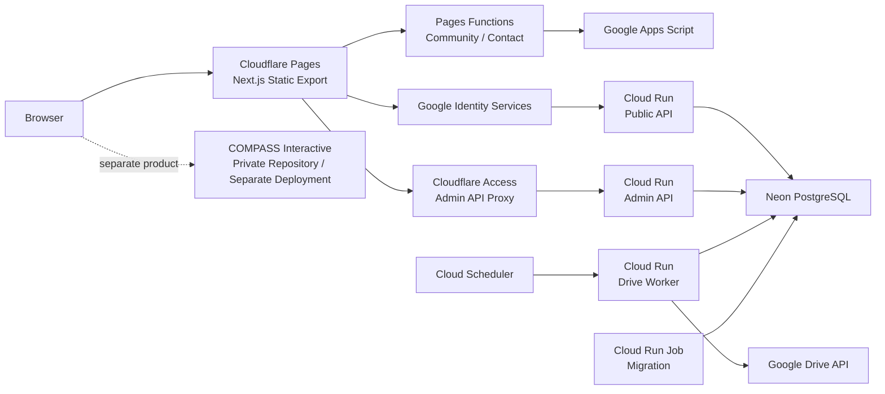

<div align="center">


# COMPASS Platform

### Don’t Just Learn. Build What’s Next.

**学びを、意思決定の力へ。**

COMPASSは、北里大学薬学部を起点として、公開Web、教育コンテンツ、利用者登録、アクセス制御、学生コミュニティ、教育支援プロダクトを統合する、学生主導の教育・テクノロジープラットフォームです。

[](https://nextjs.org/)
[](https://react.dev/)
[](https://fastapi.tiangolo.com/)
[](https://www.postgresql.org/)
[](https://www.cloudflare.com/)
[](https://cloud.google.com/run)

[公開Web](https://compass-official.pages.dev/) · [アーキテクチャ](#プラットフォーム構成) · [技術構成](#技術構成) · [クラウド開発（推奨）](#クラウド開発推奨) · [ローカル開発](#ローカル開発) · [検証](#検証) · [ドキュメント](#ドキュメント)

</div>

---

本リポジトリは、COMPASSの公開Web基盤と未来戦略ライブラリ登録基盤を管理します。ユーザーインターフェースだけでなく、Google Workspaceアカウントの検証、利用資格の判定、PostgreSQLによる状態管理、Google Drive閲覧権限の非同期処理、管理者運用、旧名簿移行、監査出力、運用文書、品質保証までを一貫して実装しています。

| | |
|---|---|
| **公開Web** | <https://compass-official.pages.dev/> |
| **メインメッセージ** | **Don’t Just Learn. Build What’s Next.** |
| **ビジョン** | **学びを、意思決定の力へ。** |
| **活動領域** | Technology · Resources · Education · Community |
| **公開導線** | Interactive · Library · Manifesto · Community |

## プラットフォーム構成



### 実行境界

| Surface | 主な責務 | Runtime |
|---|---|---|
| **Official Web** | ブランド、公開情報、Library紹介、Manifesto、公開フォーム | Next.js / Cloudflare Pages |
| **Community / Contact** | 不正送信対策、入力検証、通知処理 | Pages Functions / Turnstile / Google Apps Script |
| **Library Public API** | Google認証、利用資格判定、登録、状態照会 | FastAPI / Cloud Run |
| **Library Admin API** | 管理者認証、名簿、申請、監査、CSV/XLSX出力 | FastAPI / Cloud Run / Cloudflare Access |
| **Library Worker** | Drive権限付与・取消、再試行、収束確認 | FastAPI / Cloud Run / Cloud Scheduler |
| **Migration** | Alembic、DB role設定、旧名簿移行 | Cloud Run Job / PostgreSQL direct connection |
| **Data** | 利用者、申請、認証主体、権限、operation、監査 | Neon PostgreSQL |

COMPASS Interactiveは、講義中の資料配信、リアルタイム参加、字幕、投票、コメント、AI支援機能などを扱う独立プロダクトです。設計思想と技術構成は本サイト上の開発者向けページで公開していますが、プロダクト本体の実装および運用データは別の非公開環境で管理しています。

---

## リポジトリの責務

### 公開Web

- COMPASS公式サイト
- 活動理念、プロジェクト、教育コンテンツの紹介
- COMPASS Manifesto
- COMPASS Interactive紹介サイト
- COMPASS Interactive開発者向け技術紹介
- 未来戦略ライブラリの紹介ページ
- Community参加フォーム
- Contactフォーム

### 未来戦略ライブラリ登録基盤

- 登録ユーザーインターフェース
- Google Identity Servicesによるログイン
- Google IDトークンのサーバー検証
- Google Workspace組織への所属確認
- 入力情報とデータベース状態に基づく利用資格判定
- 利用者、申請、認証主体、権限処理状態の永続化
- Google Drive閲覧権限の付与・取消処理
- 登録状態および権限処理状態の表示
- 冪等性を備えた非同期処理
- 障害時の再試行、停止、手動復旧
- 管理者向け申請・名簿・監査・権限運用
- 旧Google Form、Sheet、Drive permissionの整合・移行
- PostgreSQL正本からの監査済みCSV/XLSX出力

### フォーム・通知基盤

- Cloudflare Pages Functions
- Cloudflare Turnstileによる不正送信対策
- Google Apps ScriptによるCommunity・Contact通知処理
- Zodによる入力検証
- フォーム処理の自動テスト

### 品質保証・運用

- TypeScript型検査
- Python APIテスト
- フォーム、Pages Function、Google Apps Scriptテスト
- Next.js本番ビルドと静的出力検証
- Playwrightによるレスポンシブ検証
- PostgreSQL統合テスト
- Alembicマイグレーション検証
- Terraform構成・activation contract検証
- Docker image・service boundary検証
- Google OAuth・Google Drive実環境E2E
- 公開ソース・Git履歴のsecret scan
- CodeQL、Dependabot、GitHub Actions quality gate
- アーキテクチャ、運用、プライバシー、障害対応文書

---

## システム境界

公開リポジトリには、アプリケーションコード、データベーススキーマ、マイグレーション、API契約、Infrastructure as Code、テスト、運用文書を配置します。

一方、次の情報は各本番サービスの管理環境に隔離されます。

- 本番利用者の個人情報
- PostgreSQLの本番データおよびバックアップ
- Google OAuthトークン
- アクセストークンおよびリフレッシュトークン
- APIキー、秘密鍵、サービスアカウント資格情報
- Neon、Google Cloud、Cloudflareの本番設定値
- Google Drive上の保護対象資料
- COMPASS Interactive本体のソースコード
- COMPASS Interactiveの認証情報、データベース、利用者データ

ソースコードと本番データを明確に分離し、秘密情報をリポジトリへ保存しないことを基本原則とします。

---

## 主要機能

### Googleアカウント検証

ブラウザで取得したGoogle IDトークンは、FastAPIへ送信され、サーバー側で検証されます。

検証対象は次のとおりです。

- 電子署名
- `aud`
- `iss`
- `exp`
- `email_verified`
- Google Workspaceドメイン情報

Google Workspaceドメインへの所属確認と、COMPASS上の利用資格判定は別の処理として扱います。ドメイン情報のみを根拠として、所属学部、在籍区分、学年、学籍番号を確定することはありません。

### 利用資格判定

利用資格は、認証済みユーザーの入力情報、同意状態、申請履歴、既存登録状態を基に、FastAPIがサーバー側で判定します。

クライアントから送信された判定結果を信用せず、重要な条件はAPI側で再評価します。

### PostgreSQLによる状態管理

Neon PostgreSQLをシステム上の正本として使用し、次の状態を管理します。

- 利用者
- 登録申請
- Google認証主体
- 資料アクセス権限
- 権限付与・取消operation
- 再試行・障害状態
- 管理者とRBAC
- 旧名簿移行batch
- Export実行履歴
- 監査に必要な処理履歴

FastAPIからの通常接続にはプール接続を使用し、Alembicによるマイグレーションには直接接続を使用します。Public、Admin、Worker、Migrationは、それぞれ独立したdatabase loginと最小権限roleを使用します。

### Google Drive権限処理

Google Driveへの権限付与と取消は、APIリクエスト内で直接完結させず、非同期ワーカーによって処理します。

処理基盤には次の設計を採用しています。

- Transactional Outbox
- 冪等なoperation
- リソース単位のLease
- 有限回の再試行
- `dead`状態への隔離
- 手動Requeue
- 重複実行の抑制
- HMAC-SHA256によるversioned operation attestation
- Worker専用の固定Drive targetとOAuth credential
- 権限付与・取消の収束確認

外部サービスへの副作用は、必要な運用フラグ、認証、署名、対象固定、安全条件がすべて成立した場合にのみ許可されます。条件が不完全な場合は処理を停止する、fail-closedの設計です。

### 管理者運用

管理者surfaceは、公開登録surfaceから分離されています。

- Cloudflare Access
- Same-origin Pages Function proxy
- Private edge secret
- 管理専用Google OAuth audience
- 完全一致メールallowlist
- Server-side Google `sub` RBAC
- `viewer` / `operator` / `admin`の権限分離
- 重要操作の理由、楽観lock、冪等性、再確認
- Append-only監査とPIIを含まないsecurity event
- CSV/XLSXのformula injection対策とSHA-256照合

---

## 技術構成

| Layer | Technology |
|---|---|
| **Web Frontend** | Next.js 16.2.11 · React 19 · TypeScript 5.9 · Zod 4 · Static Export |
| **Identity** | Google Identity Services · OpenID Connect · `google-auth` · Google Picker API |
| **Application API** | Python 3.12–3.13 · FastAPI · Pydantic 2 · Uvicorn |
| **Data Access** | SQLAlchemy 2 · Psycopg 3 · PostgreSQL 17 · Neon |
| **Schema** | Alembic · Versioned SQL boundary · Database role audit |
| **Access Automation** | Google Drive API · Transactional Outbox · Lease · Retry · Operation Attestation |
| **Edge** | Cloudflare Pages · Pages Functions · Turnstile · Cloudflare Access |
| **Application Runtime** | Google Cloud Run · Cloud Run Job · Cloud Scheduler |
| **Secrets / Operations** | Google Secret Manager · Cloud Monitoring · Budget guardrails |
| **Infrastructure as Code** | Terraform · Docker · Docker Compose |
| **Notifications** | Google Apps Script · Google Drive standard notification |
| **Analytics** | Google Analytics 4 · Cloudflare Web Analytics |
| **Quality** | Vitest · Pytest · Playwright · CodeQL · GitHub Actions |

---

## クラウド開発（推奨）

通常の開発はGitHub CodespacesまたはCodex Cloudで開始します。Docker Desktop、VS Code Dev Containers、Dev Container CLIも同じ`.devcontainer/devcontainer.json`を使用するため、PCやエージェントが変わってもNode.js、Python、Docker、GitHub CLI、テスト環境は一致します。

最短経路、Docker CLI経路、Codex／Claude Code／GitHub Copilotの共通運用、スマートフォンからの監督方法は[`docs/CLOUD_DEVELOPMENT.md`](docs/CLOUD_DEVELOPMENT.md)を参照してください。

---

## ローカル開発

### 必要環境

| Runtime | Version / Tooling |
|---|---|
| Node.js | `.node-version` — `22.16.0` |
| Python | `services/library-api/.python-version` — `3.12` |
| Python package manager | `uv` |
| Container runtime | Docker Desktop / Docker Compose |
| Local database | PostgreSQL 17 container |

Windowsでは、Node.jsコマンドを`npm.cmd`で実行します。

クラウド環境はrepositoryごとに分離し、既存PCの未commit変更やProduction資格情報を引き継ぎません。ローカル環境は障害対応や特殊なデバイス検証の補助経路です。

### Webフロントエンド

```powershell
npm.cmd ci
npm.cmd run dev
```

通常のNext.js開発サーバーは、静的routeとユーザーインターフェースの確認に使用します。Cloudflare Pages Functionsを含む構成は、静的出力を生成した後にPages local runtimeで確認します。

```powershell
npm.cmd run build
npm.cmd run dev:pages
```

### FastAPI

```powershell
Set-Location services/library-api
uv sync
uv run python -m alembic upgrade head
uv run python -m uvicorn app.main:app --reload
```

ローカルのcomposite APIは`app.main:app`、分離されたruntime entrypointは`app.public_main:app`、`app.admin_main:app`、`app.worker_main:app`です。

### PostgreSQL / Docker

登録基盤専用wrapperは、Compose project、network、volume、ownership label、localhost portを固定し、他のCOMPASS環境から分離します。

```powershell
powershell.exe -NoProfile -ExecutionPolicy Bypass -File `
  .\scripts\library-docker-dev.ps1 -Action Validate

powershell.exe -NoProfile -ExecutionPolicy Bypass -File `
  .\scripts\library-docker-dev.ps1 -Action Up

powershell.exe -NoProfile -ExecutionPolicy Bypass -File `
  .\scripts\library-docker-dev.ps1 -Action Test

powershell.exe -NoProfile -ExecutionPolicy Bypass -File `
  .\scripts\library-docker-dev.ps1 -Action Down
```

ローカルAPIは`http://127.0.0.1:58000`、PostgreSQLは`127.0.0.1:55432`を使用します。

---

## 検証

### Repository総合検証

```powershell
npm.cmd run check
```

`check`は、公開ソース境界、Community／Contact、Library登録／管理、release gate、TypeScript、Production build、static export、全公開routeのPlaywright responsive smokeを順に検証します。

### API検証

```powershell
Set-Location services/library-api
uv run python -m pytest
```

APIテストでは、認証token検証、利用資格判定、データアクセス、RBAC、rate limit、冪等性、Outbox、Drive operation、管理者操作、旧名簿移行、CSV/XLSX出力、障害時挙動を検証します。

### マイグレーション検証

```powershell
Set-Location services/library-api
uv run python -m alembic upgrade head
uv run python -m alembic downgrade -1
uv run python -m alembic upgrade head
uv run python -m alembic check
```

### PostgreSQL統合検証

```powershell
powershell.exe -NoProfile -ExecutionPolicy Bypass -File `
  .\scripts\library-docker-dev.ps1 -Action Phase9Phase10Test
```

このgateは、PostgreSQL migration、database role、旧名簿移行、監査制約、API競合、CSV/XLSX生成を専用container上で検証します。

### Infrastructure as Code

```powershell
powershell.exe -NoProfile -ExecutionPolicy Bypass -File `
  .\scripts\library-docker-dev.ps1 -Action TerraformValidate
```

Terraformのformat、backendを使用しないinitialization、validation、activation contract testを実行します。

### レスポンシブ完全監査

```powershell
npm.cmd run check:responsive:full
```

完全監査では、正式なviewport matrix、Windows表示倍率、browser chromeを考慮した実効表示領域、意味を損なわない改行、Mobile menu、CTA hit test、clipping、visual regression、failure artifactを検証します。

詳細は[`docs/responsive-browser-qa.md`](docs/responsive-browser-qa.md)を参照してください。

### Google実環境E2E

```powershell
powershell.exe -NoProfile -ExecutionPolicy Bypass -File `
  .\scripts\start-phase6a-local-e2e.ps1

powershell.exe -NoProfile -ExecutionPolicy Bypass -File `
  .\scripts\start-phase7-drive-e2e.ps1
```

Google OAuthとGoogle DriveのE2Eでは、次の経路を確認します。

1. Googleアカウントで認証
2. IDトークンをFastAPIで検証
3. 登録申請をPostgreSQLへ保存
4. Outbox operationを作成
5. WorkerがGoogle Drive APIを実行
6. Drive権限状態をデータベースへ反映
7. Clientが処理結果を取得
8. 権限を取消し、OAuth grantとテスト資産をclean up

実環境E2Eでは、本番利用者の資料や資格情報を使用せず、検証専用のGoogleアカウントとDrive resourceを使用します。

---

## ディレクトリ構成

```text
src/
├─ app/
│  ├─ (official)/                  COMPASS公式サイト・公開フォーム
│  ├─ (interactive)/               Interactive紹介・開発者向けページ
│  └─ (library)/                   Library登録・管理者route
├─ components/                     共通UIコンポーネント
├─ sections/                       公式サイト各section
├─ interactive/                    Interactive紹介UI
└─ library-registration/           登録・認証・管理者UI・API client

services/
└─ library-api/
   ├─ app/                          Public / Admin / Worker FastAPI
   ├─ migrations/                   Alembic・SQL boundary
   ├─ scripts/                      DB role・移行・検証・運用tool
   └─ tests/                        Python unit / integration test

functions/
├─ api/                             Community / Contact Pages Functions
└─ library-registration/admin/api/ Admin same-origin proxy

infra/library-registration/
└─ terraform/                       Cloud Run・IAM・Secret・Monitoring

contracts/library-registration/     資格判定・旧名簿移行contract
google-apps-script/                  Community・Contact通知処理
tests/                               Web・Function・GAS・release gate
scripts/                             Build・Deploy・E2E・security検証
docs/                                Architecture・運用・Governance
Project.guide/                       COMPASS理念・brand・履歴資料
```

### 公式サイトのエントリーポイント

```text
src/app/(official)/page.tsx
  └─ src/App.tsx
       └─ src/LegacyPageBody.tsx
```

`LegacyPageBody.tsx`は名称にかかわらず、現在の本番表示経路を構成するmoduleです。ファイルの利用状況は名称から推測せず、import graph、routing、build output、static exportを基に判断してください。

---

## セキュリティと信頼性

| Principle | Implementation |
|---|---|
| **Server-authoritative** | 認証、利用資格、権限状態をAPIとdatabaseで再検証 |
| **Least privilege** | Surface別service account、DB login、DB role、secret binding |
| **Secret isolation** | Secret Manager、環境変数、numeric version pinning |
| **Idempotency** | 登録、管理者mutation、Drive付与・取消の重複実行を制御 |
| **Fail-closed** | 設定不足、署名不一致、認証失敗、依存異常時に副作用を停止 |
| **Auditability** | 申請、判定、管理操作、権限処理、exportを追跡可能に記録 |
| **PII minimization** | Token、検索語、個人情報をlog・analytics・artifactへ出力しない |
| **Recovery** | Retry、dead state、manual requeue、read-only mode、kill switch |
| **Public-source security** | Source公開を前提にedge、identity、RBAC、DB roleを多層化 |

---

## デプロイメント

| Component | Deployment |
|---|---|
| 公開Web | Next.js Static Export / Cloudflare Pages |
| Community / Contact | Cloudflare Pages Functions / Turnstile / Google Apps Script |
| 登録API | FastAPI Public Service / Google Cloud Run |
| 管理API | Cloudflare Access / Pages Proxy / FastAPI Admin Service |
| 権限処理 | Internal Cloud Run Worker / Cloud Scheduler / Google Drive API |
| Migration | Cloud Run Job / Alembic / Direct DB Connection |
| Database | Neon PostgreSQL / Pooled Runtime Connections |
| Secrets | Google Secret Manager / Cloudflare Encrypted Secrets |
| Infrastructure | Terraform / Immutable Container Images |

各serviceは独立してデプロイし、公開Web、Public API、Admin API、Worker、Migration、Database、外部権限処理の障害境界を分離します。

---

## ドキュメント

| Document | Responsibility |
|---|---|
| [`AGENTS.md`](AGENTS.md) | Coding Agent向けの実装契約、変更原則、検証要件 |
| [`Project.guide/PROJECT_GUIDE.md`](Project.guide/PROJECT_GUIDE.md) | COMPASSの理念、brand、project原則 |
| [`docs/README.md`](docs/README.md) | 文書索引、正本文書、参照関係 |
| [`docs/ARCHITECTURE.md`](docs/ARCHITECTURE.md) | Repository、deployment、data、外部serviceの境界 |
| [`docs/CONTENT_GOVERNANCE.md`](docs/CONTENT_GOVERNANCE.md) | Copy、CTA、公開状態、指標の管理方針 |
| [`docs/responsive-browser-qa.md`](docs/responsive-browser-qa.md) | Responsive検証、viewport matrix、failure artifact |
| [`docs/library-registration/`](docs/library-registration/) | 登録基盤の認証、data model、privacy、運用、E2E |
| [`infra/library-registration/README.md`](infra/library-registration/README.md) | Cloud Run、IAM、Secret Manager、Terraform構成 |
| [`services/library-api/README.md`](services/library-api/README.md) | FastAPI、PostgreSQL、Drive Workerの開発・運用 |
| [`CODEX_LINKS.md`](CODEX_LINKS.md) | 正式な公開URLと画面遷移契約 |

---

## 開発原則

1. データベースを状態管理の正本とする
2. 認証と利用資格判定を分離する
3. クライアント入力を信頼せず、サーバー側で再検証する
4. Public、Admin、Worker、Migrationの責務と権限を分離する
5. 外部副作用を非同期処理として分離する
6. 重要処理に冪等性を持たせる
7. 障害時は安全側へ停止する
8. 本番データとソースコードを分離する
9. 実装、テスト、運用文書を同じ変更単位で更新する
10. ブランド上の説明と、実装機能の説明を区別する
11. 技術的な主張を、コード、テスト、運用状態によって裏付ける

---

## 組織上の位置づけ

COMPASSは、学生有志が運営する独立した学生支援活動です。

北里大学、北里大学薬学部、各研究室、関連機関が運営する公式サービスではありません。試験、履修、進級、研究室配属、進路に関する重要事項は、必ず大学等の公式情報で確認してください。
