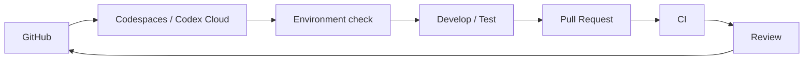

<div align="center">


# COMPASS Platform

### Don’t Just Learn. Build What’s Next.

**学びを、意思決定の力へ。**

COMPASSは、北里大学薬学部を起点として、公開Web、教育コンテンツ、利用者登録、アクセス制御、学生コミュニティ、教育支援プロダクトを統合する、学生主導の教育・テクノロジープラットフォームです。

[](https://nextjs.org/)
[](https://react.dev/)
[](https://fastapi.tiangolo.com/)
[](https://www.postgresql.org/)
[](https://www.cloudflare.com/)
[](https://cloud.google.com/run)
[](https://codespaces.new/genellect/compass?quickstart=1)
[](https://github.com/genellect/compass/actions/workflows/devcontainer-contract.yml)

[公開Web](https://compass-official.pages.dev/) · [Cloud-first Development](#cloud-first-development) · [アーキテクチャ](#プラットフォーム構成) · [技術スタック](#技術構成) · [検証](#検証) · [ドキュメント](#ドキュメント)

</div>

---

COMPASS Platformは、公開Webから利用者管理基盤までを一貫して支える、Web・認証・権限管理の統合基盤です。Webフロントエンドだけでなく、Google Workspaceによる本人確認と利用資格判定、PostgreSQLでの状態管理、Google Driveの権限付与までを一つのリポジトリで扱っています。


| | |
|---|---|
| **公開Web** | <https://compass-official.pages.dev/> |
| **メインメッセージ** | **Don’t Just Learn. Build What’s Next.** |
| **ビジョン** | **学びを、意思決定の力へ。** |
| **活動領域** | Technology · Resources · Education · Community |
| **公開導線** | Interactive · Library · Manifesto · Community |

## Cloud-first Development

> [!IMPORTANT]
> **開発環境はGitHub上で統一しています。**
> 通常の開発にはGitHub CodespacesまたはCodex Cloudを使用します。Windows / macOS / ブラウザのどこから入っても、Dev Container、依存関係、環境チェック、CIは共通です。

### Codespacesで開始

1. **[Open in GitHub Codespaces](https://codespaces.new/genellect/compass?quickstart=1)** を開く。
2. 初期セットアップの完了後、次を実行する。

```bash
npm run dev:doctor
npm run dev:cloud
```

`3000`番ポートが転送され、そのままブラウザまたはVS Codeから開発できます。

変更後の確認は以下です。

```bash
npm run cloud:check
```

commit、push、Pull RequestまでCodespaces内で完結します。

| Environment              | Version / Command         |
| ------------------------ | ------------------------- |
| Node.js                  | `22.16.0`                 |
| Package manager          | npm / `package-lock.json` |
| pnpm CLI                 | `11.20.0`                 |
| Python / uv              | `3.12` / `0.11.28`        |
| Docker / Compose         | `29.7.1` / `5.4.0`        |
| GitHub CLI / Copilot CLI | `2.97.0` / `1.0.78`       |
| Environment check        | `npm run dev:doctor`      |
| Full check               | `npm run cloud:check`     |

### 開発環境

| Environment                 | 用途                |
| --------------------------- | ----------------- |
| **GitHub Codespaces**       | ブラウザや別PCからのアクセス   |
| **Codex Cloud**             | Codexによる実装        |
| **VS Code Dev Containers**  | ローカルDocker環境での開発  |
| **Dev Container CLI**       | CI・自動化            |
| **ChatGPT / GitHub mobile** | PR・CI・Codexタスクの確認 |

各リポジトリのコンテナ、`node_modules`、キャッシュ、ローカルDBは分離されています。COMPASS Interactiveや他プロジェクトの開発環境とは共有しません。

### Secrets

通常の開発とmock buildにはsecretを必要としません。

秘密情報が必要な処理では、GitHub CodespacesまたはCodex CloudのSecretsを使用します。`.env.local`、秘密鍵、API key、token、production dataはリポジトリに含めません。

詳細なセットアップ、Docker構成、Codex / Claude Code / Copilotからの利用方法、復旧手順は `docs/CLOUD_DEVELOPMENT.md` にまとめています。


### システム構成

| Component               | 役割                            | Stack                                            |
| ----------------------- | ----------------------------- | ------------------------------------------------ |
| **Official Web**        | COMPASS公式サイト、Library案内、公開フォーム | Next.js / Cloudflare Pages                       |
| **Community / Contact** | フォーム受付、不正送信対策、通知              | Pages Functions / Turnstile / Google Apps Script |
| **Library API**         | Google認証、利用資格の確認、登録、利用状況の取得   | FastAPI / Cloud Run                              |
| **Admin API**           | 利用者・申請管理、監査、データ出力             | FastAPI / Cloud Run / Cloudflare Access          |
| **Drive Worker**        | Google Driveの閲覧権限付与・取消        | Cloud Run / Cloud Scheduler                      |
| **Migration**           | DB migration、role設定、既存データの移行  | Alembic / Cloud Run Jobs                         |
| **Database**            | 利用者、申請、権限、処理履歴、監査ログ           | Neon PostgreSQL                                  |

COMPASS Interactiveは、講義中の資料配信、リアルタイム参加、字幕、投票、コメント、AI機能などを扱う独立したプロダクトです。アプリケーション本体は別リポジトリ・別環境で開発、運用しています。

---

## リポジトリ構成

本リポジトリでは、COMPASS公式Web、問い合わせフォーム、及び未来戦略ライブラリの登録・運用基盤を管理しています。

### COMPASS Web

公式サイト、Manifesto、未来戦略ライブラリの案内、Community / Contactフォームなど、COMPASSの公開Webを管理します。

### 未来戦略ライブラリ

Google Workspaceを利用した本人確認・利用資格判定、PostgreSQLでの登録状態管理、Google Drive権限の付与・取消、管理者向け運用、データ移行・監査を扱います。

### COMPASS Interactive

COMPASS Interactiveは独立したプロダクトとして、紹介Webサイトを除き別リポジトリ・別環境で開発、運用しています。

---

## 公開範囲

本リポジトリでは、アプリケーションコード、データベーススキーマ、Infrastructure as Code、テスト、運用ドキュメントを公開しています。

本番環境の認証情報、APIキー、個人情報、データベース、バックアップ、Google Drive上の保護対象資料は、公開リポジトリでは管理しません。

COMPASS Interactiveのアプリケーション本体と運用データも、独立した非公開環境で管理しています。

---

## 技術スタック

| Layer                      | Technology                                                                      |
| -------------------------- | ------------------------------------------------------------------------------- |
| **Web Frontend**           | Next.js 16.2.11 · React 19 · TypeScript 5.9 · Zod 4 · Static Export             |
| **Identity**               | Google Identity Services · OpenID Connect · `google-auth` · Google Picker API   |
| **Application API**        | Python 3.12–3.13 · FastAPI · Pydantic 2 · Uvicorn                               |
| **Data Access**            | SQLAlchemy 2 · Psycopg 3 · PostgreSQL 17 · Neon                                 |
| **Schema**                 | Alembic · Versioned SQL boundary · Database role audit                          |
| **Access Automation**      | Google Drive API · Transactional Outbox · Lease · Retry · Operation Attestation |
| **Edge**                   | Cloudflare Pages · Pages Functions · Turnstile · Cloudflare Access              |
| **Application Runtime**    | Google Cloud Run · Cloud Run Job · Cloud Scheduler                              |
| **Secrets / Operations**   | Google Secret Manager · Cloud Monitoring · Budget guardrails                    |
| **Infrastructure as Code** | Terraform · Docker · Docker Compose                                             |
| **Notifications**          | Google Apps Script · Google Drive standard notification                         |
| **Analytics**              | Google Analytics 4 · Cloudflare Web Analytics                                   |
| **Quality**                | Vitest · Pytest · Playwright · CodeQL · GitHub Actions                          |


## クラウド開発（推奨）

開発にはGitHub CodespacesまたはCodex Cloudを推奨します。ローカルで開発する場合も、`.devcontainer/devcontainer.json`から同じ環境を立ち上げられます。

セットアップや各環境での使い方は [`docs/CLOUD_DEVELOPMENT.md`](docs/CLOUD_DEVELOPMENT.md) を参照してください。

環境の確認には次を使用します。

```bash
npm run dev:doctor
```

Node.js、Python、Docker、CLI、依存関係など、開発に必要な環境をまとめて確認できます。追加の依存関係はDev Containerまたはlockfileで管理します。


---

## ローカル開発

### 必要環境

| Runtime | Version / Tooling |
|---|---|
| Node.js | `.node-version` — `22.16.0` |
| Python | `services/library-api/.python-version` — `3.12` |
| Python package manager | `uv` |
| Container runtime | Docker Desktop / Docker Compose |
| Local database | PostgreSQL 17 container |

Windowsでは、Node.jsコマンドを`npm.cmd`で実行します。

クラウド環境はrepositoryごとに分離し、既存PCの未commit変更やProduction資格情報を引き継ぎません。ローカル環境は障害対応や特殊なデバイス検証の補助経路です。

### Webフロントエンド

```powershell
npm.cmd ci
npm.cmd run dev
```

通常のNext.js開発サーバーは、静的routeとユーザーインターフェースの確認に使用します。Cloudflare Pages Functionsを含む構成は、静的出力を生成した後にPages local runtimeで確認します。

```powershell
npm.cmd run build
npm.cmd run dev:pages
```

### FastAPI

```powershell
Set-Location services/library-api
uv sync
uv run python -m alembic upgrade head
uv run python -m uvicorn app.main:app --reload
```

ローカルのcomposite APIは`app.main:app`、分離されたruntime entrypointは`app.public_main:app`、`app.admin_main:app`、`app.worker_main:app`です。

### PostgreSQL / Docker

登録基盤専用wrapperは、Compose project、network、volume、ownership label、localhost portを固定し、他のCOMPASS環境から分離します。同じactionをbashとPowerShellの両方から実行できます。

Linux / Dev Container / Codespaces:

```bash
./scripts/library-docker-dev.sh Validate
./scripts/library-docker-dev.sh Up
./scripts/library-docker-dev.sh Test
./scripts/library-docker-dev.sh Down
```

Windows PowerShell:

```powershell
powershell.exe -NoProfile -ExecutionPolicy Bypass -File `
  .\scripts\library-docker-dev.ps1 -Action Validate

powershell.exe -NoProfile -ExecutionPolicy Bypass -File `
  .\scripts\library-docker-dev.ps1 -Action Up

powershell.exe -NoProfile -ExecutionPolicy Bypass -File `
  .\scripts\library-docker-dev.ps1 -Action Test

powershell.exe -NoProfile -ExecutionPolicy Bypass -File `
  .\scripts\library-docker-dev.ps1 -Action Down
```

ローカルAPIは`http://127.0.0.1:58000`、PostgreSQLは`127.0.0.1:55432`を使用します。

---

## 検証

### Repository総合検証

```bash
npm run check
```

`check`は、公開ソース境界、Community／Contact、Library登録／管理、release gate、TypeScript、Production build、static export、全公開routeのPlaywright responsive smokeを順に検証します。cloud環境では同一gateの別名`npm run cloud:check`を使用します。Windows PowerShellから直接実行する場合のみ`npm.cmd run check`と読み替えます。

### API検証

```bash
cd services/library-api
uv run python -m pytest
```

APIテストでは、認証token検証、利用資格判定、データアクセス、RBAC、rate limit、冪等性、Outbox、Drive operation、管理者操作、旧名簿移行、CSV/XLSX出力、障害時挙動を検証します。

### マイグレーション検証

```bash
cd services/library-api
uv run python -m alembic upgrade head
uv run python -m alembic downgrade -1
uv run python -m alembic upgrade head
uv run python -m alembic check
```

### PostgreSQL統合検証

```bash
./scripts/library-docker-dev.sh Phase9Phase10Test
```

このgateは、PostgreSQL migration、database role、旧名簿移行、監査制約、API競合、CSV/XLSX生成を専用container上で検証します。Windowsからは`scripts/library-docker-dev.ps1 -Action Phase9Phase10Test`が同じactionを提供します。

### Infrastructure as Code

```bash
./scripts/library-docker-dev.sh TerraformValidate
```

Terraformのformat、backendを使用しないinitialization、validation、activation contract testを実行します。

### レスポンシブ監査

cloud（Codespaces / Codex Cloud / Claude Code / Dev Container）では次を実行します。

```bash
npm run check:responsive:cloud
```

visual regression baselineはWindowsで生成された`*-win32.png`のため、Windows専用の完全監査は次になります。

```powershell
npm.cmd run check:responsive:full
```

完全監査では、正式なviewport matrix、Windows表示倍率、browser chromeを考慮した実効表示領域、意味を損なわない改行、Mobile menu、CTA hit test、clipping、visual regression、failure artifactを検証します。cloudからはGitHub Actions **Responsive Quality Gate** の結果をvisual regressionの判定に使用します。

詳細は[`docs/responsive-browser-qa.md`](docs/responsive-browser-qa.md)を参照してください。

### Google実環境E2E

```powershell
powershell.exe -NoProfile -ExecutionPolicy Bypass -File `
  .\scripts\start-phase6a-local-e2e.ps1

powershell.exe -NoProfile -ExecutionPolicy Bypass -File `
  .\scripts\start-phase7-drive-e2e.ps1
```

Google OAuthとGoogle DriveのE2Eでは、次の経路を確認します。

1. Googleアカウントで認証
2. IDトークンをFastAPIで検証
3. 登録申請をPostgreSQLへ保存
4. Outbox operationを作成
5. WorkerがGoogle Drive APIを実行
6. Drive権限状態をデータベースへ反映
7. Clientが処理結果を取得
8. 権限を取消し、OAuth grantとテスト資産をclean up

実環境E2Eでは、本番利用者の資料や資格情報を使用せず、検証専用のGoogleアカウントとDrive resourceを使用します。

---

## ディレクトリ構成

```text
src/
├─ app/
│  ├─ (official)/                  COMPASS公式サイト・公開フォーム
│  ├─ (interactive)/               Interactive紹介・開発者向けページ
│  └─ (library)/                   Library登録・管理者route
├─ components/                     共通UIコンポーネント
├─ sections/                       公式サイト各section
├─ interactive/                    Interactive紹介UI
└─ library-registration/           登録・認証・管理者UI・API client

services/
└─ library-api/
   ├─ app/                          Public / Admin / Worker FastAPI
   ├─ migrations/                   Alembic・SQL boundary
   ├─ scripts/                      DB role・移行・検証・運用tool
   └─ tests/                        Python unit / integration test

functions/
├─ api/                             Community / Contact Pages Functions
└─ library-registration/admin/api/ Admin same-origin proxy

infra/library-registration/
└─ terraform/                       Cloud Run・IAM・Secret・Monitoring

contracts/library-registration/     資格判定・旧名簿移行contract
google-apps-script/                  Community・Contact通知処理
tests/                               Web・Function・GAS・release gate
scripts/                             Build・Deploy・E2E・security検証
docs/                                Architecture・運用・Governance
Project.guide/                       COMPASS理念・brand・履歴資料
```

### 公式サイトのエントリーポイント

```text
src/app/(official)/page.tsx
  └─ src/App.tsx
       └─ src/LegacyPageBody.tsx
```

`LegacyPageBody.tsx`は名称にかかわらず、現在の本番表示経路を構成するmoduleです。ファイルの利用状況は名称から推測せず、import graph、routing、build output、static exportを基に判断してください。

---

## セキュリティと信頼性

| Principle | Implementation |
|---|---|
| **Server-authoritative** | 認証、利用資格、権限状態をAPIとdatabaseで再検証 |
| **Least privilege** | Surface別service account、DB login、DB role、secret binding |
| **Secret isolation** | Secret Manager、環境変数、numeric version pinning |
| **Idempotency** | 登録、管理者mutation、Drive付与・取消の重複実行を制御 |
| **Fail-closed** | 設定不足、署名不一致、認証失敗、依存異常時に副作用を停止 |
| **Auditability** | 申請、判定、管理操作、権限処理、exportを追跡可能に記録 |
| **PII minimization** | Token、検索語、個人情報をlog・analytics・artifactへ出力しない |
| **Recovery** | Retry、dead state、manual requeue、read-only mode、kill switch |
| **Public-source security** | Source公開を前提にedge、identity、RBAC、DB roleを多層化 |

---

## デプロイメント

| Component | Deployment |
|---|---|
| 公開Web | Next.js Static Export / Cloudflare Pages |
| Community / Contact | Cloudflare Pages Functions / Turnstile / Google Apps Script |
| 登録API | FastAPI Public Service / Google Cloud Run |
| 管理API | Cloudflare Access / Pages Proxy / FastAPI Admin Service |
| 権限処理 | Internal Cloud Run Worker / Cloud Scheduler / Google Drive API |
| Migration | Cloud Run Job / Alembic / Direct DB Connection |
| Database | Neon PostgreSQL / Pooled Runtime Connections |
| Secrets | Google Secret Manager / Cloudflare Encrypted Secrets |
| Infrastructure | Terraform / Immutable Container Images |

各serviceは独立してデプロイし、公開Web、Public API、Admin API、Worker、Migration、Database、外部権限処理の障害境界を分離します。

---

## ドキュメント

| Document | Responsibility |
|---|---|
| [`AGENTS.md`](AGENTS.md) | Coding Agent向けの実装契約、変更原則、検証要件 |
| [`Project.guide/PROJECT_GUIDE.md`](Project.guide/PROJECT_GUIDE.md) | COMPASSの理念、brand、project原則 |
| [`docs/README.md`](docs/README.md) | 文書索引、正本文書、参照関係 |
| [`docs/ARCHITECTURE.md`](docs/ARCHITECTURE.md) | Repository、deployment、data、外部serviceの境界 |
| [`docs/CONTENT_GOVERNANCE.md`](docs/CONTENT_GOVERNANCE.md) | Copy、CTA、公開状態、指標の管理方針 |
| [`docs/responsive-browser-qa.md`](docs/responsive-browser-qa.md) | Responsive検証、viewport matrix、failure artifact |
| [`docs/library-registration/`](docs/library-registration/) | 登録基盤の認証、data model、privacy、運用、E2E |
| [`infra/library-registration/README.md`](infra/library-registration/README.md) | Cloud Run、IAM、Secret Manager、Terraform構成 |
| [`services/library-api/README.md`](services/library-api/README.md) | FastAPI、PostgreSQL、Drive Workerの開発・運用 |
| [`CODEX_LINKS.md`](CODEX_LINKS.md) | 正式な公開URLと画面遷移契約 |
