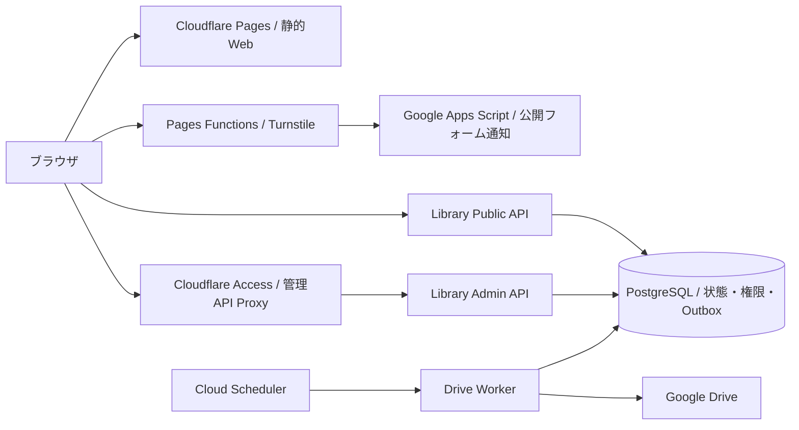

# COMPASS Platform

**Don’t Just Learn. Build What’s Next.**
**学びを、意思決定の力へ。**

COMPASSは、北里大学薬学部を起点とする、学生主導の教育・テクノロジープラットフォームです。Technology・Resources・Education・Communityの4領域で、学生の「知る」を「選ぶ」「動く」へつなげます。

このリポジトリには、3D空間を取り入れた公式Web、未来戦略ライブラリの利用者登録・権限管理基盤、公開フォーム、テスト、インフラ定義、運用ドキュメントを収録しています。体験の設計から配信、認証、データ管理、継続的な検証まで、実装をたどれる構成です。

[公開Web](https://compass-official.pages.dev/) · [技術スタック](#技術スタック) · [開発を始める](#開発を始める) · [文書索引](docs/README.md) · [利用許可](#ライセンスと利用許可)

## プロダクトと実装範囲

| 対象 | このリポジトリで扱う内容 |
|---|---|
| 公式Web | 活動紹介、3D Habitat、未来戦略ライブラリ案内、Manifesto、Community、Contact |
| 公開フォーム | 入力検証、Turnstile、Pages Functions、Google Apps Scriptによる通知 |
| Library登録基盤 | Google本人確認、利用資格判定、登録・管理API、DB権限、Drive連携、移行・監査ツール |
| Interactive紹介 | 独立したプロダクトの紹介・開発者向けページ |
| yuto-matsui.com | 同じ配信成果物を使用する独立Webサイト |

COMPASS Interactiveのアプリケーション本体は、別リポジトリ・別環境で開発しています。紹介ページやyuto-matsui.comの編集には、それぞれの対象を指定した依頼が必要です。配置と編集範囲は[Website Boundaries](docs/WEBSITE_BOUNDARIES.md)に記載しています。

以下は現行ソースの構成です。登録基盤の外部認証・実データ・本番運用の確認状況は、[ロードマップ](docs/library-registration/phase-roadmap-v3.md)と対象コミットの検証記録で管理しています。公開ソースには、本番データ、認証情報、保護されたLibrary資料を含めません。

## 体験を支える技術

### ブラウザで描く3D空間

公式トップのHabitatは、Three.jsによるWebGL描画とHTMLの情報表示を組み合わせています。9つのセクションに対応する部屋とカメラを設計し、1つのレンダラーで空間を描画します。文章、リンク、フォームは通常のDOMとして操作できます。

建築と家具はBlenderで制作・配置し、間接光をライトマップへ焼き込みます。実行時にはPBR材質、HDR環境光、視点に応じた反射、Bloomを組み合わせ、MeshoptとWebPで配信データを圧縮しています。共有する建築データと部屋ごとの照明を管理し、必要なセクションに応じてアセットを読み込みます。

画面幅と入力方式に応じて3Dを起動し、低フレームレート、読み込み失敗、動きを減らす設定ではポスター表示へ移行します。非表示タブでは描画を停止し、終了時にはGPUリソースを解放します。Web Audioによる環境音は利用者の操作で有効になり、ページ離脱時に停止します。

実装は[Habitat](src/components/Habitat/)、制作手順は[Authoring Guide](scripts/habitat/README.md)、素材の出典は[Asset Credits](scripts/habitat/ASSET_CREDITS.md)を参照してください。通常のWebビルドにBlenderは必要ありません。

### モバイルと映像表現

縦向きのタブレットやスマートフォンでは、NASAのISS写真と短いタイムラプスを使った構成を提供します。動画は表示領域や通信条件に応じて読み込み・再生を制御し、データ節約設定、低速回線、再生失敗時には静止画を表示します。モバイル経路で3DエンジンやGLBを取得しないこともテストしています。

Contactの入口には、手続き的に制作したBlenderの建築映像を使用しています。映像上の扉にHTMLボタンを重ね、選択した導線の映像を読み込みます。スキップ、動きを減らす設定、読み込み失敗の各経路でもフォームへ進める構成です。

制作条件と操作契約は[Mobile Space Media](docs/mobile-space-media.md)と[Contact Door Entry](docs/contact-door-entry.md)に記載しています。

### 登録からアクセス権の反映まで

未来戦略ライブラリの登録基盤は、Public API、Admin API、Drive Workerを個別のエントリーポイントとして実装しています。GoogleのIDトークンをサーバー側で検証し、利用資格と管理者権限を再判定します。

PostgreSQLでは用途ごとのDBロールと限定されたRPCを使用します。Driveへの権限反映はTransactional Outboxへ記録し、WorkerがLease、Retry、操作の署名検証を通じて処理します。管理操作、権限変更、出力処理には監査記録を設けています。



図はリポジトリで定義する論理構成です。サービスごとの公開条件と運用状態は[Architecture](docs/ARCHITECTURE.md)、認可の詳細は[Admin Access Security Boundary](docs/library-registration/admin-access-security-boundary.md)を参照してください。

## 技術スタック

バージョンはこのリポジトリの依存定義に対応します。配信済みのバージョンはデプロイ先のコミットで確認します。

| 領域 | 技術と用途 |
|---|---|
| Web | Next.js 16.3.4 · React 19 · TypeScript 5.9 · Zod 4 · Static Export |
| 3D | Three.js 0.185 · WebGL · glTF/GLB · Meshopt · PBR · HDR · 焼き込みライトマップ |
| 素材制作 | Blender 4.5 LTS · Open Image Denoise · glTF Transform 4.5 · FFmpeg · WebP/H.264 |
| 音・操作 | Web Audio API · Native DOM · Pointer / Keyboard · Reduced Motion |
| Edge配信 | Cloudflare Pages · Pages Functions · Turnstile · Cloudflare Access |
| API・認証 | Python 3.12–3.13 · FastAPI · Pydantic 2 · Uvicorn · Google Identity Services / OpenID Connect |
| データ | PostgreSQL 17 · Neon · SQLAlchemy 2 · Psycopg 3 · Alembic |
| 権限処理 | Google Drive API · Transactional Outbox · Lease / Retry · Operation Attestation |
| 実行環境・IaC | Google Cloud Run / Jobs · Cloud Scheduler · Secret Manager · Terraform · Docker Compose |
| 通知・計測 | Google Apps Script · Google Analytics 4 · Cloudflare Web Analytics |
| 検証 | Vitest · Pytest · Playwright · Node.js Test Runner · CodeQL · npm Audit · OSV |
| 開発環境 | GitHub Codespaces · Dev Containers · Codex Cloud · npm / uv lockfiles |

正確な解決バージョンは[package-lock.json](package-lock.json)と[uv.lock](services/library-api/uv.lock)、ツールの固定値は[toolchain.env](.devcontainer/toolchain.env)にあります。

## 品質と保守

| 検証対象 | 確認する契約 |
|---|---|
| フォーム・API | 入力、資格判定、認証・認可、署名、重複処理、通知の異常系 |
| 配信成果物 | 静的出力、公開ルート、Pages Functionsの適用範囲、Libraryのビルド対象 |
| レスポンシブ | CSS viewport、実改行、はみ出し、メニュー、キーボード操作、画像差分 |
| 3D・メディア | 起動条件、遅延読み込み、停止・復帰、フォールバック、モバイルの通信境界 |
| 公開ソース | 秘密情報・保護資料の混入、Git履歴、Actionとコンテナの固定参照 |
| 依存関係 | npm / uvの既知脆弱性、ライセンス式、ツール定義の整合、依存一覧 |

CIはこれらの契約を継続確認します。実機の描画性能、外部サービスとの接続、本番の運用確認は、測定条件と検証したコミットを記録します。テストの合格を未検証環境へ一般化しない方針です。

## 開発を始める

通常の開発にはGitHub CodespacesまたはCodex Cloudを使用します。共通のlockfileと検証コマンドを用い、プロジェクトごとの環境を保持します。開発・mock buildに本番の認証情報は必要ありません。

### GitHub Codespaces

1. [Open in GitHub Codespaces](https://codespaces.new/genellect/compass?quickstart=1)を開き、セットアップ完了を待ちます。
2. 次のコマンドで環境を確認し、開発サーバーを起動します。

```bash
npm run dev:doctor
npm run dev:cloud
```

Codespacesの転送ポートから画面を確認できます。Codex Cloudでは[setup script](.codex/setup.sh)が依存を準備します。環境別の起動・復旧手順は[Cloud Development](docs/CLOUD_DEVELOPMENT.md)にあります。

### 変更後の確認

```bash
npm run check:repository
npm run check
```

`check:repository`は文書リンク、ツール定義、ライセンス、保守スクリプトを確認します。`check`はフォーム関連テスト、型検査、ビルド、静的出力、レスポンシブ・Habitatのブラウザ検証を実行します。`cloud:check`は`check`の別名です。Windows PowerShellから直接実行するときは`npm.cmd run`を使用してください。

API・専用ローカルDB・E2Eの手順は[Development Workflows](docs/development-workflows.md)、依存更新と監査は[Dependency Maintenance](docs/dependency-maintenance.md)を参照してください。画像差分の基準画像はWindowsで管理しています。

## ソースを読む

| ディレクトリ・入口 | 内容 |
|---|---|
| [`src/app/`](src/app/) | 公式Web、紹介ページ、Libraryのルート |
| [`src/components/Habitat/`](src/components/Habitat/) | 3Dエンジン、セクション、メディア・音声の制御 |
| [`scripts/habitat/`](scripts/habitat/) / [`scripts/contact-entry/`](scripts/contact-entry/) | 素材の制作・変換・検査 |
| [`src/library-registration/`](src/library-registration/) | 登録・管理画面、APIクライアント |
| [`functions/`](functions/) | 公開フォーム、管理API Proxy、ドメインルーティング |
| [`services/library-api/`](services/library-api/) | API、Worker、migration、Pythonテスト |
| [`infra/library-registration/`](infra/library-registration/) | Terraform、実行環境、IAM・運用定義 |
| [`google-apps-script/`](google-apps-script/) | Community・Contact等の通知処理 |
| [`tests/`](tests/) / [`.github/workflows/`](.github/workflows/) | 動作契約、公開境界、CI |

公式トップの表示経路は`src/app/(official)/page.tsx` → `src/App.tsx` → `src/LegacyPageBody.tsx`です。`LegacyPageBody.tsx`は現在も使用しているモジュールです。

## ドキュメント

| 文書 | 目的 |
|---|---|
| [Documentation Index](docs/README.md) | 正本文書、運用手順、過去の記録への入口 |
| [Project Guide](Project.guide/PROJECT_GUIDE.md) | 理念、ブランド、プロジェクト原則 |
| [Architecture](docs/ARCHITECTURE.md) | 配信・認証・データ・外部サービスの構成 |
| [Content Governance](docs/CONTENT_GOVERNANCE.md) | 正式な文言、CTA、公開状態、指標の管理 |
| [Responsive QA](docs/responsive-browser-qa.md) | ブラウザ検証と画像差分の手順 |
| [Library Registration](docs/library-registration/) | 登録基盤の設計、プライバシー、運用・公開ゲート |
| [AGENTS.md](AGENTS.md) | エージェント向けの作業範囲、実装・検証・承認規則 |

ブランチでの変更とCI確認を経て、レビュー可能なPull Requestを作成します。本番へ影響する操作には権利者の事前承認が必要です。既存CDは維持し、mainへの反映が本番配信を起動する場合は公開操作として扱います。

## ライセンスと利用許可

Copyright © 2026 **Yuto Matsui**. ソースを閲覧・評価できる形で公開しています。

**事前の明示的な書面許可のない商用利用・改変・再配布は禁止します。** 非営利の改変・再配布にも許可が必要です。条件の正文は[LICENSE](LICENSE)、申請方法は[利用許可](docs/legal/permissions.md)を参照してください。

GitHub規約、適用法、既存の個別契約に基づく権利は維持されます。第三者のOSS・写真・映像等には、それぞれのライセンスが適用されます。[Third-party Notices](THIRD_PARTY_NOTICES.md)と[素材台帳](docs/legal/asset-register.md)に出典と取扱いを記載しています。脆弱性の報告は[Security Policy](.github/SECURITY.md)をご確認ください。
