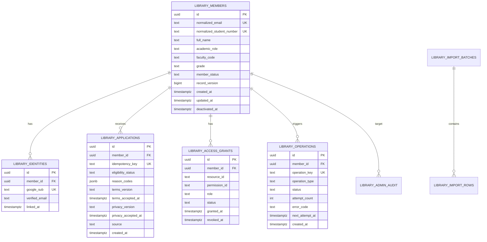

# Phase 5 着手準備・完了記録

最終更新: 2026-07-16  
状態: `PHASE 5 PASS`

本書の着手準備は完了しており、現在は
`phase5-postgresql-integration-gate.md`のPASS証跡へ引き継がれている。
Phase 4ブロッカー解除の介助作業は
`phase4-blocker-resolution-pack.md`を参照する。

## 1. Phase 5の目的

外部APIを呼ばず、合成データだけでPostgreSQL正本、申請履歴、重複防止、停止状態、監査、マイグレーション、復旧手順を実装する。

## 2. 実装範囲

- SQLAlchemy 2 Declarative model。
- Alembic。
- Psycopg 3。
- Pydantic Settings。
- repository/service層。
- transactionと一意制約。
- PostgreSQL統合テスト。
- PIIを含まない構造化ログ。

含めない:

- Google Identity Services。
- Drive/Gmail API。
- 管理者画面。
- 旧Sheet import。
- 実利用者データ。

## 3. 予定依存関係

実装着手時にuvで追加し、lock差分と供給元をレビューする。

```toml
sqlalchemy = ">=2.0.51,<2.1"
alembic = ">=1.18.5,<2"
psycopg = { version = ">=3.3.4,<4", extras = ["binary", "pool"] }
pydantic-settings = ">=2,<3"
```

根拠:

- SQLAlchemy 2.0系の安定版を使用し、2.1 betaへ上げない。
- Alembic 1.18系を使用する。
- 新規開発はPsycopg 3を使用する。
- HTTPX2は既存TestClientが利用しているため維持する。

参考:

- [SQLAlchemy PyPI](https://pypi.org/project/SQLAlchemy/)
- [Alembic PyPI](https://pypi.org/project/alembic/)
- [Psycopg PyPI](https://pypi.org/project/psycopg/)

## 4. 接続方針

| 用途 | 環境変数 | 接続 |
| --- | --- | --- |
| FastAPI実行 | `DATABASE_URL` | Neon pooled endpoint |
| Alembic・復旧 | `DATABASE_URL_UNPOOLED` | Neon direct endpoint |

初期値:

- application pool size: 2
- max overflow: 0
- pool timeout: 5秒
- pool recycle: 240秒
- statement timeout: 10秒
- migrationは単独実行

PgBouncer transaction modeではsession-level advisory lock等を前提にしない。必要な排他はPostgreSQL transaction、unique constraint、行lockで行う。
Neon pooled URLではPgBouncerが未対応startup parameterを拒否するため、
`statement_timeout`のstartup optionを渡さない。direct URLでは設定値を
維持する。

## 5. データモデル



管理者、監査、import/exportは同一metadataで定義するが、最初のmigrationは登録・名簿・operationの中心表から開始し、1 migrationを過大化させない。

## 6. マイグレーション順

1. PostgreSQL extensionsと共通enum方針。
2. `library_members`。
3. `library_identities`。
4. `library_applications`。
5. `library_access_grants`。
6. `library_operations`。
7. `library_admins`と`library_admin_audit`。
8. `library_import_batches/rows`と`library_export_runs`。

DB enumではなくcheck constraintまたは参照表を第一候補とし、将来の状態追加をAlembicで安全に扱えるようにする。

## 7. テスト計画

- migrationを空DBへ適用。
- 同じmetadataからschema差分0件。
- 正規化メール重複。
- 学籍番号重複。
- `google_sub`重複。
- 同一idempotency key再送。
- 同時2 transaction。
- optimistic lock競合。
- application追加でmember履歴を失わない。
- deactivationと再有効化。
- operation再試行上限。
- PIIログマスキング。
- direct connectionでdump/restore。

## 8. 着手前チェック

- [x] Python 3.12.13とuv 0.11.28が作業領域内で利用可能。
- [x] 現行Pythonテスト14件成功。
- [x] 現行TypeScriptテスト14件、型検査、静的ビルド成功。
- [x] `.env`実ファイルなし。
- [x] DB・Google秘密情報なし。
- [x] `.env.example`に値ではなく契約だけを用意。
- [x] Drive/Gmail副作用をPhase 5から除外。
- [ ] Nodeを22.16.0へ統一。
- [x] Neon開発project/branchを作成。
- [x] pooled/direct接続文字列をローカル秘密情報として設定。
- [x] Phase 5依存関係を追加しuv.lockをレビュー。

ローカル実装とNeon PostgreSQL統合ゲートは完了した。Node 22.16.0への
統一は再現性改善として継続するが、今回明示されたPostgreSQL統合ゲートの
PASS条件には含めない。

## 9. Phase 5完了ゲート

- [x] Alembicで空DBを再現できる。
- [x] migrationとアプリ接続を分離できる。
- [x] 同時二重登録をDB制約で防げる。
- [x] 申請履歴と現役名簿を分離できる。
- [x] backup/restoreを別branchで再現できる。
- [x] ログにPII・DB URLがない。
- [x] 外部副作用が無効である。

正式判定と実測値は`phase5-postgresql-integration-gate.md`を参照する。
